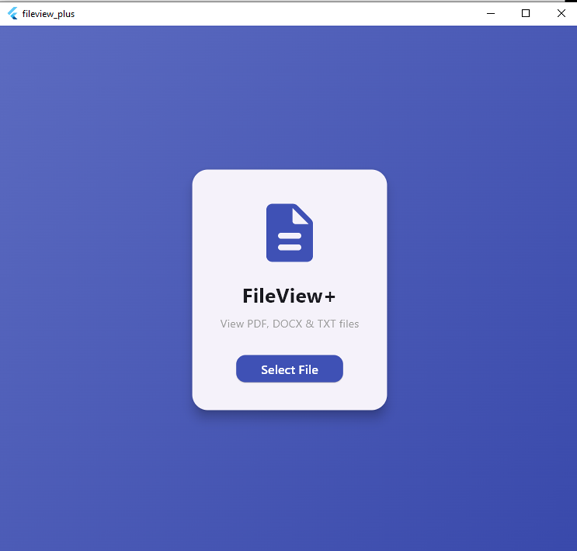
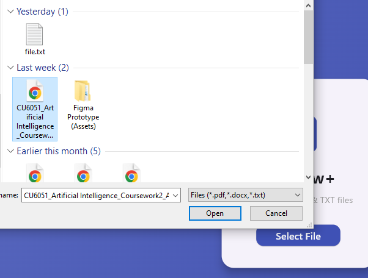
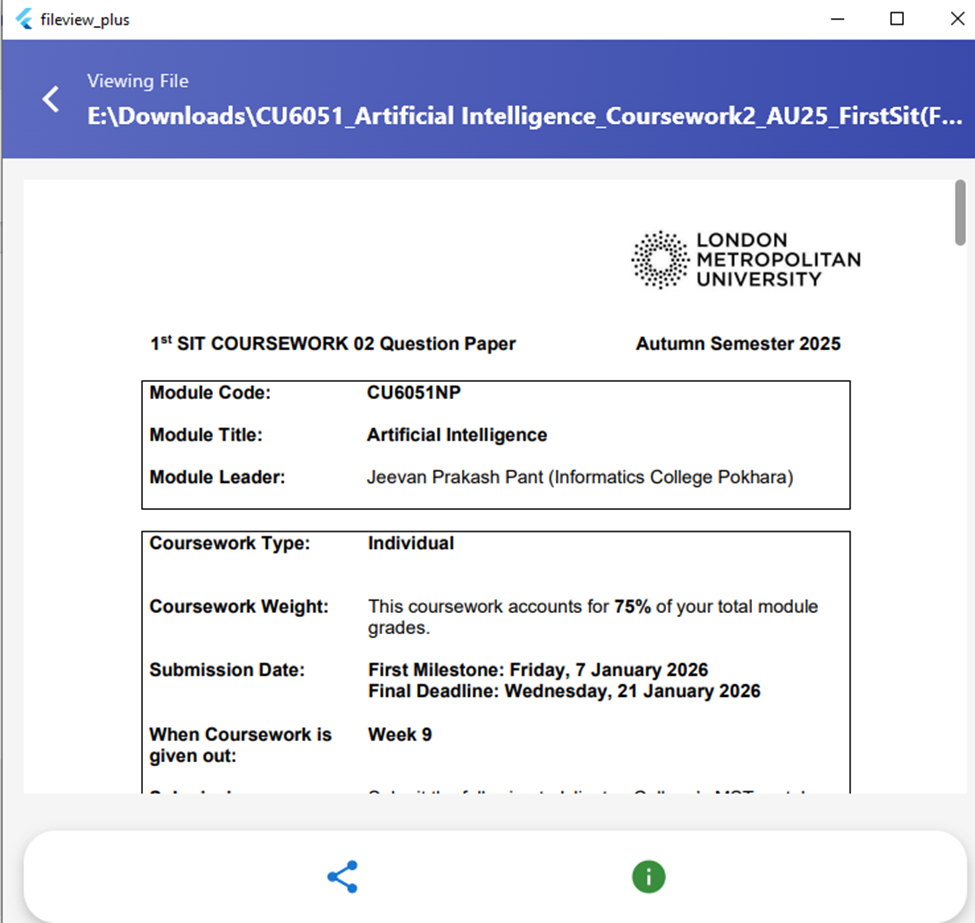
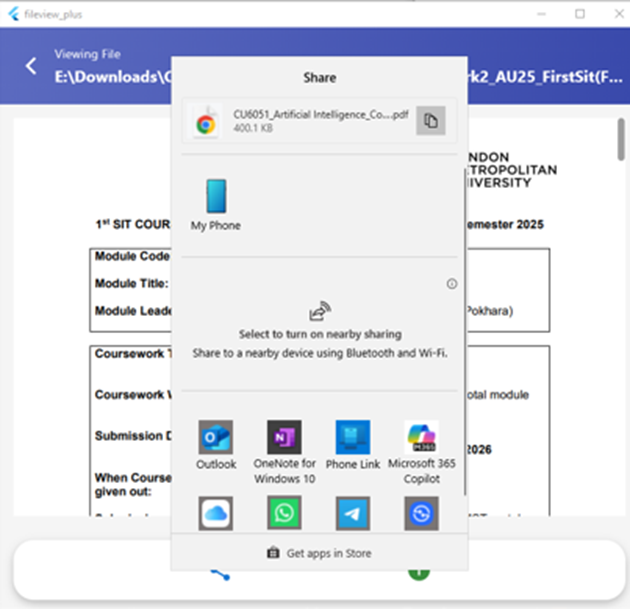
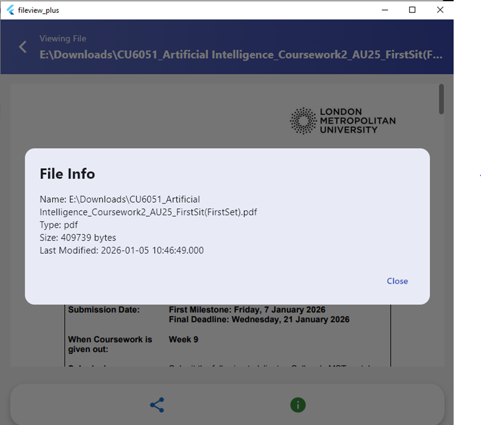

# fileview_plus

A new Flutter project.

## Getting Started

This project is a starting point for a Flutter application.

The main goal of this project is to demonstrate:
Clean UI design
File handling in Flutter
Navigation between screens

## Objective
Allows users to select a file from their device
Display selected files in a viewer screen
Support PDF, DOCX, and TXT formats
Provide action buttons (Share, Info)
Show file information such as name, size, type, and last modified data

## Features Implemented
- Display app title FileView+ 
- Button to select a file 
()

## File Viewer Screen
- Display selected file content 
- PDF using Syncfusion PDF Viewer
- DOCX converted to readable text
- TXT files

 

## Action Buttons
- Allow sharing the selected file

 
- Which show File name, File type , File size, Last modified date

## Technology Stack
- Flutter : UI framework
- syncfusion_flutter_pdfviewer : PDF viewing
- docx_to_text : Share files
- file_picker : Pick files from device
# fileview_plus
# fileview_plus
